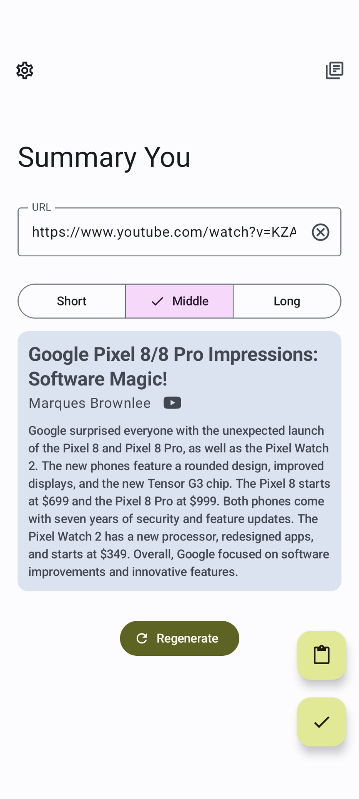
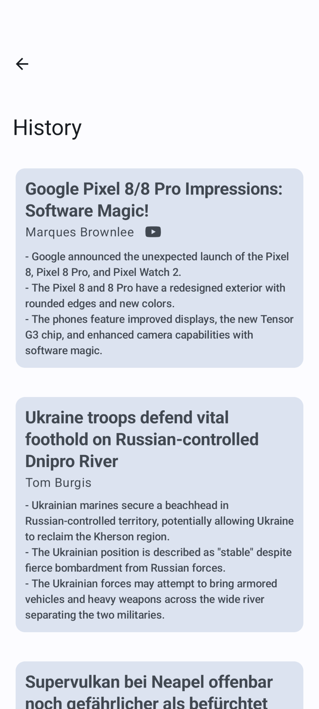
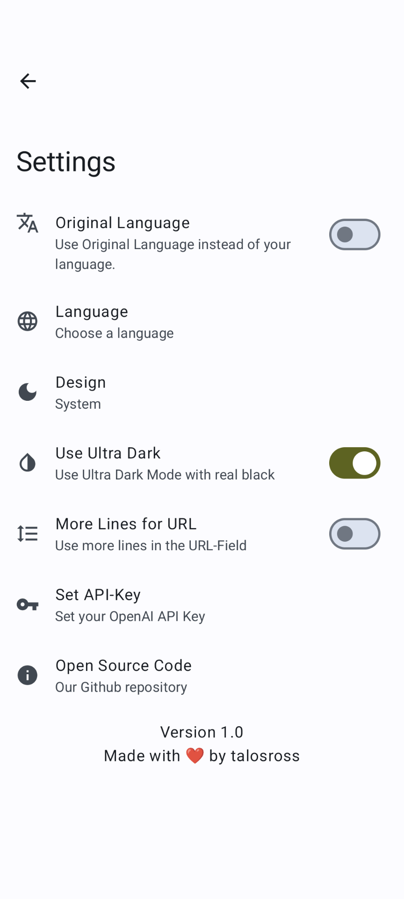
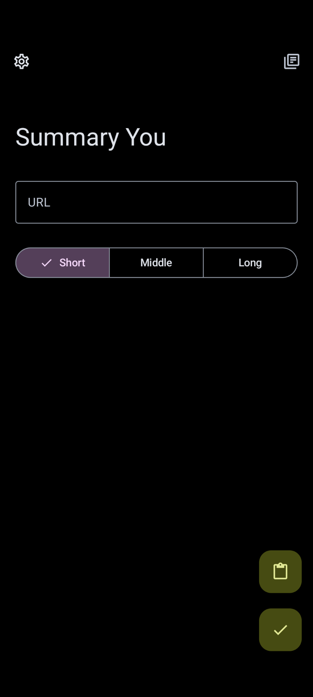

# Summary You

### Summarize YouTube-Videos & Articles with AI

## 📱 Screenshots

 

## 📖 Features

- Summarize YouTube-Videos & Articles with AI

- Set length of summary

- History-Section
  
- intelligent paywall detection

- OLED-Dark Mode

- Easy to use and user-friendly.

- [Material Design 3](https://m3.material.io/) style UI, with dynamic color theme.

## ⭐️ Star History

[]

## 🧱 Credits

Python with [Chaquopy](https://github.com/chaquo/chaquopy) as backend

Some of the UI designs and codes are borrowed from [Seal](https://github.com/JunkFood02/Seal)

[Material color utilities](https://github.com/material-foundation/material-color-utilities)

## 📃 License

>**Warning**
>
>Except for the source code licensed under the GPLv3 license,
>all other parties are prohibited from using Seal's name as a downloader app,
>and the same is true for Seal's derivatives.
>Derivatives include but are not limited to forks and unofficial builds.

<table><td>
<a href="#start-of-content">👆 Scroll to top</a>
</td></table>

