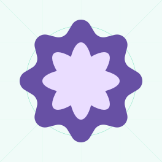
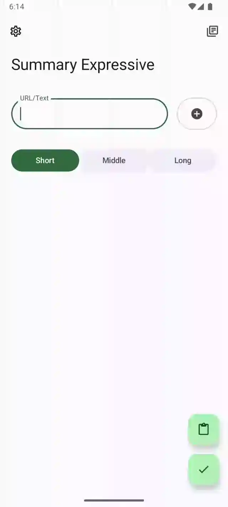

# Summary Expressive

A modern, BYOK and FOSS android app to summarize videos(YouTube, BiliBili), articles, images and
documents with AI/LLM.

[MAD](https://developer.android.com/courses/pathways/android-architecture): pure Kotlin + Jetpack Compose + M3 Expressive

## 📱 Screenshots

  
  
  

## 🔗 Downloads

Minimal Android version: **13**

### Github Release

There are 2 releases available:

- **standalone** which
  includes [ML model](https://developers.google.com/ml-kit/vision/text-recognition/v2) to recognize
  text from image, it got larger package size.

- **gms** which allows user to download the model from Google Play Services, but GMS required.

### Play Store

The Play Store release bundled with gms version. This package is signed by Google managed key for
simplicity, which means it's not compatible to update in Google Play Store if you installed a github
package previously.

## 📖 Features

- **Summarize multiple media types**

| media        | supported types                     |
|--------------|-------------------------------------|
| Video (Link) | YouTube, BiliBili                   |
| Document     | MS Word, PDF                        |
| Image        | Jpg, Png, Webp (Latin only for now) |
| Text         | Article link, Plain text            |

- Multiple LLM providers supported

  - OpenAI Chatgpt
  - Google Gemini
  - Anthropic Claude
  - Alibaba Qwen
  - DeepSeek
  - Mistral
  - OpenRouter
  - Ollama

- **[Material 3 Expressive](https://m3.material.io/blog/building-with-m3-expressive) UI**: Engaging
  and easier to use, light/dark theme and dynamic color theme

- **Instant summarize via share sheet or text selection toolbar**: Convenient to trigger summarization, show result in overlayer

- **Configurable LLM settings**

- **Text to speech for the summaries with multilingual and speed adjustment support**

- **History search**

## 🌟 Credits

- The [original idea](https://github.com/talosross/SummaryYou)
  from [talosross](https://github.com/talosross)

- [Koog](https://koog.ai) for kotlin-based LLM interactions
