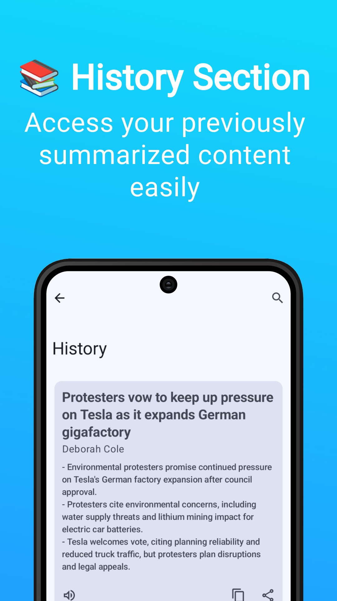

# Summary Expressive

### Summarize YouTube-Videos, Articles, Images and Documents with AI

## 📱 Screenshots

---

## Play Store Version (coming soon)

## 📖 Features

- Summarize YouTube-Videos, Articles, Images and Documents with AI

- Set length of summary

- Read-Out the summaries

- History-Section

- Intelligent paywall detection

- OLED-Dark Mode

- Easy to use and user-friendly.

- [Material 3 Expressive](https://m3.material.io/blog/building-with-m3-expressive) style UI, with
  dynamic color theme.

It uses OpenAI/Gemini to summarize.

<table><td>
<a href="#start-of-content">👆 Scroll to top</a>
</td></table>

