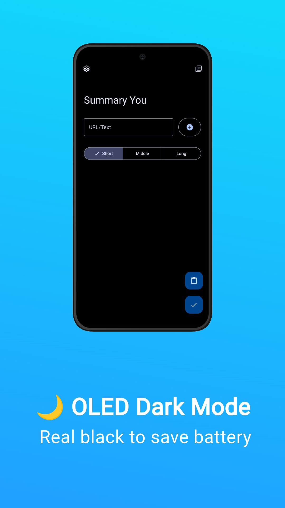

# Summary Expressive

### Summarize YouTube-Videos, Articles, Images and Documents with AI

## 📱 Screenshots

---

## Play Store Version (coming soon)

## 📖 Features

- Summarize YouTube-Videos, Articles, Images and Documents with AI

- Set length of summary

- Read-Out the summaries

- History-Section

- Intelligent paywall detection

- OLED-Dark Mode

- Easy to use and user-friendly.

- [Material Design 3](https://m3.material.io/) style UI, with dynamic color theme.

It uses GPT-3.5 OpenAI/Mixtral 8x7B Groq to summarize.

## ⭐️ Star History

## 🧱 Credits

Python with [Chaquopy](https://github.com/chaquo/chaquopy) as backend

Some of the UI designs and codes are borrowed from [Seal](https://github.com/JunkFood02/Seal)

[Material color utilities](https://github.com/material-foundation/material-color-utilities)

## 📃 License

<table><td>
<a href="#start-of-content">👆 Scroll to top</a>
</td></table>

